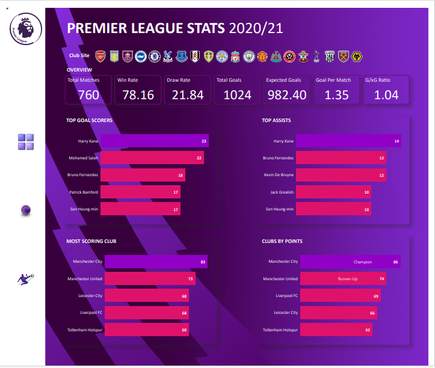

# ENGLISH PREMIER LEAGUE 2020/21 STAT

## PROJECT OVERVIEW
Football, as a sport, is not just a game; it's a captivating narrative of strategy, competition, and the relentless pursuit of excellence. 
The Premier League, being one of the most watched and celebrated football leagues globally, serves as an ideal playground for data enthusiasts 
seeking to uncover the intricacies of team and player performance.

## OBJECTIVES
- League Performance
- Team Peformance
- Player Stats

## TOOLS USED 
- MS Excel (Connected to Data Source)
- Power BI (Manipulation and Visualization)
    - [Power BI Report](https://app.powerbi.com/groups/me/reports/edf8fd78-93b9-4f0e-ad55-b136913cb5ea/ReportSection?experience=power-bi)

## DATA SOURCE
FBREF WEBSITE
- [Download Here](https://fbref.com/en/comps/9/Premier-League-Stats)

## LEAGUE OVERVIEW

The Premier League 2020/21 season witnessed an impressive 78.16% win rate across 760 matches, highlighting the competitive nature of the league. The average goals per match stood at 1.35, with a notable G/xG ratio of 1.04, suggesting that teams performed slightly better than their expected levels.

Top scorers Harry Kane, Mohammed Salah, and Bruno Fernandez demonstrated exceptional goal-scoring prowess, contributing significantly to their teams. The trio of Manchester City, Manchester United, and Leicester City emerged as the most scoring teams, showcasing offensive prowess throughout the season.

In the assists department, Harry Kane, Bruno Fernandez, and Kelvin De Bruyne played crucial roles in creating goal-scoring opportunities for their teammates.

The ultimate triumph went to Manchester City, securing the league championship with a total of 86 points. Their consistent performance, both in attack and defense, solidified their dominance throughout the season.
